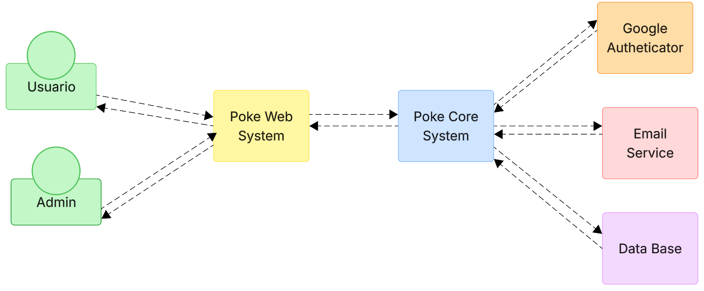
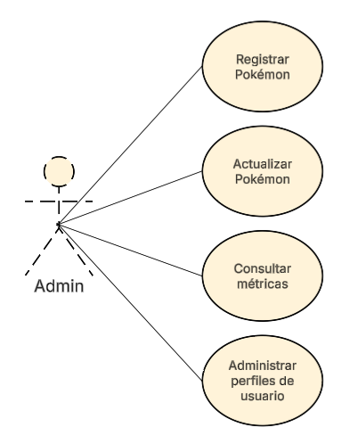
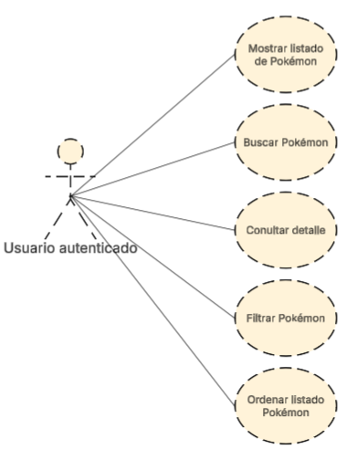
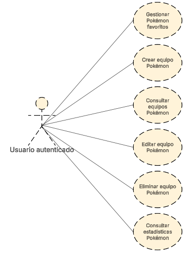
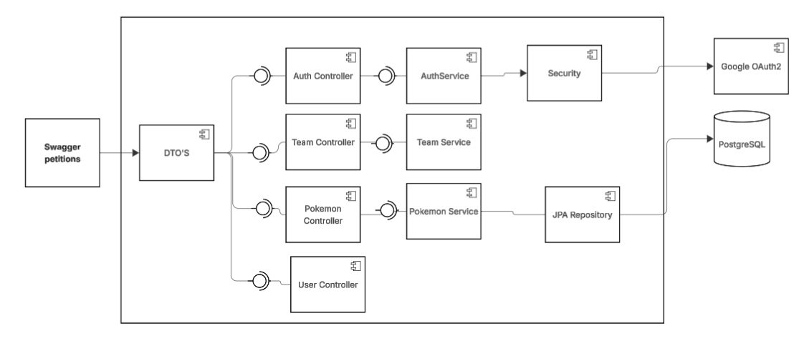

# Pokédex API

API REST para una aplicación web inspirada en la Pokédex de Pokémon. Permite a los entrenadores crear su perfil, consultar y filtrar Pokémon, gestionar favoritos y construir equipos para analizar sus ventajas competitivas.

## Descripción

El sistema expone endpoints para la gestión de Pokémon, usuarios, autenticación y equipos. Está construido con **Java 21**, **Spring Boot**, **PostgreSQL** (datos relacionales) y **MongoDB** (vistas y estadísticas). La seguridad se maneja con **JWT** y **OAuth2 (Google)**.

## Tecnologías

| Capa | Tecnología |
|---|---|
| Lenguaje | Java 21 |
| Framework | Spring Boot 4 |
| Base de datos relacional | PostgreSQL |
| Base de datos documental | MongoDB |
| Seguridad | Spring Security, JWT, OAuth2 |
| Mapeo | MapStruct |
| Build | Maven |

## Arquitectura

El proyecto sigue una arquitectura en capas con separación estricta de responsabilidades:

```
controller/   - APIs, DTOs, mappers, manejo de excepciones
core/         - Lógica de negocio, modelos, servicios, validadores
persistence/  - Entidades JPA/MongoDB, repositorios, adaptadores
config/       - Configuración general, CORS, async
security/     - JWT, OAuth2, filtros de seguridad
```

## Requerimientos

El documento completo de requerimientos funcionales y no funcionales está disponible en:

[📄 docs/requirements/Requerimientos.md](docs/requirements/Requerimientos.md)

### Estado de cumplimiento (backend)

#### Cumplidos

- **RF-01** Crear perfil de usuario
- **RF-02** Iniciar sesión mediante Gmail
- **RF-03** Registrar Pokémon
- **RF-04** Actualizar Pokémon
- **RF-11** Gestionar Pokémon favoritos
- **RF-12** Crear equipo Pokémon
- **RF-13** Consultar equipos Pokémon
- **RF-14** Editar equipo Pokémon
- **RF-15** Eliminar equipo Pokémon
- **RF-17** Consultar métricas administrativas
- **RF-18** Administrar perfiles de usuario

#### Parcialmente cumplidos

- **RF-05** Eliminar Pokémon: existe eliminación física, pero no desactivación ni bloqueo si está en equipos
- **RF-06** Mostrar listado de Pokémon: existe listado paginado, pero es público y no exige autenticación
- **RF-07** Buscar Pokémon: hay búsqueda por número en servicio, pero no hay endpoint por nombre ni coincidencia parcial
- **RF-08** Consultar detalle de Pokémon: devuelve tipos y estadísticas, pero no habilidades ni evolución
- **RF-09** Filtrar Pokémon: filtra por tipo, región, generación, hasMega y rango de stats; faltan habilidad, ataque y rol competitivo
- **RF-10** Ordenar listado de Pokémon: el listado principal admite paginación y orden; el filtro no ordena ni permite orden por estadística individual
- **RF-16** Consultar estadísticas de Pokémon: existe ranking de más consultados; no hay tasa de elección en equipos

#### No cumplidos

- Búsqueda por nombre parcial (**RF-07**)
- Filtros por habilidad, ataque y rol competitivo (**RF-09**)
- Desactivación de Pokémon (**RF-05**)
- Tasa de elección en equipos (**RF-16**)
- Habilidades y evolución en el detalle (**RF-08**)

#### Requerimientos no funcionales

- **RFN-01** Rendimiento: sin pruebas que validen el límite de 2,5 segundos
- **RFN-02** Visual: corresponde al frontend
- **RFN-03** Multidispositivo: corresponde al frontend
- **RFN-04** Seguridad: parcialmente cumplido en backend (BCrypt, JWT, OAuth2, roles)

## Diagramas

### Diagrama de Contexto



### Historias de Usuario — Administrador



### Historias de Usuario — Usuario Autenticado





### Diagrama de Componentes.



### Diagrama de Entidad - Relación.


**Hisotorias de Usuario detalladas:**

### RF-01: Crear perfil de usuario
Como usuario visitante, quiero crear un perfil con mi nombre de usuario, correo electrónico y contraseña, para poder acceder a la Pokédex como entrenador registrado.

### RF-02: Iniciar sesión mediante Gmail
Como usuario registrado, quiero iniciar sesión con mi cuenta de Gmail, para entrar a la Pokédex sin crear otro método de acceso.

### RF-03: Registrar Pokémon
Como administrador, quiero registrar nuevos Pokémon en la Pokédex, para mantener actualizada la información disponible para los usuarios.

### RF-04: Actualizar Pokémon
Como administrador, quiero modificar la información de un Pokémon existente, para corregir o actualizar sus datos dentro de la Pokédex.

### RF-05: Eliminar Pokémon
Como administrador, quiero eliminar o desactivar un Pokémon registrado, para retirar de la Pokédex información que ya no debe estar disponible.

### RF-06: Mostrar listado de Pokémon
Como usuario autenticado, quiero ver el listado de Pokémon disponibles, para consultar rápidamente los Pokémon registrados en la aplicación.

### RF-07: Buscar Pokémon
Como usuario autenticado, quiero buscar Pokémon por nombre o número de Pokédex, para encontrar rápidamente un Pokémon específico.

### RF-08: Consultar detalle de Pokémon
Como usuario autenticado, quiero consultar el detalle completo de un Pokémon, para conocer sus tipos, estadísticas, habilidades y evolución.

### RF-09: Filtrar Pokémon
Como usuario autenticado, quiero filtrar Pokémon por diferentes criterios, para reducir el listado y encontrar Pokémon según mis necesidades.

### RF-10: Ordenar listado de Pokémon
Como usuario autenticado, quiero ordenar el listado de Pokémon por nombre, número o estadística, para visualizar la información según el criterio que prefiera.

### RF-11: Gestionar Pokémon favoritos
Como usuario autenticado, quiero agregar o retirar Pokémon de mi lista de favoritos, para guardar los Pokémon que más me interesan.

### RF-12: Crear equipo Pokémon
Como usuario autenticado, quiero crear un equipo Pokémon con nombre propio, para organizar Pokémon según mi estrategia.

### RF-13: Consultar equipos Pokémon
Como usuario autenticado, quiero consultar mis equipos Pokémon, para revisar los equipos asociados a mi perfil.

### RF-14: Editar equipo Pokémon
Como usuario autenticado, quiero editar el nombre o la composición de un equipo, para mantener mis equipos actualizados.

### RF-15: Eliminar equipo Pokémon
Como usuario autenticado, quiero eliminar un equipo Pokémon propio, para retirar equipos que ya no necesito.

### RF-16: Consultar estadísticas de Pokémon
Como usuario autenticado, quiero consultar estadísticas de Pokémon, para conocer cuáles son más usados o populares en la aplicación.

### RF-17: Consultar métricas administrativas
Como administrador, quiero consultar métricas administrativas de uso, para conocer cuántas veces se han consultado los Pokémon.

### RF-18: Administrar perfiles de usuario
Como administrador, quiero administrar perfiles de usuario, para consultar usuarios registrados, actualizar su estado y cambiar sus roles.
